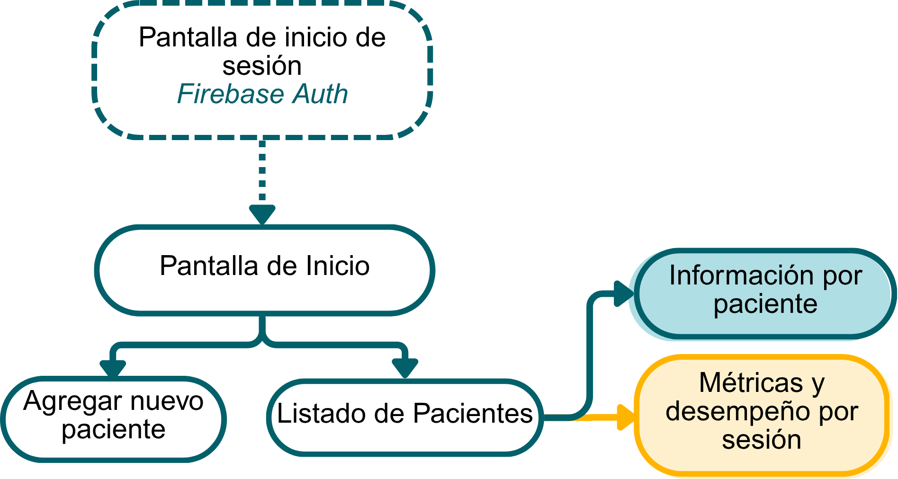

# SIR-HAPT App — Gestión Terapéutica

Aplicación de escritorio para la gestión terapéutica del sistema **SIR-HAPT** (*Sistema Inmersivo con Retroalimentación Háptica para Terapia*). Desarrollada en Python con KivyMD y respaldada por Firebase Firestore y Authentication, permite al terapeuta registrar pacientes, configurar sesiones y consultar las métricas de desempeño generadas durante cada sesión en el serious game de realidad mixta.

> Este repositorio forma parte del Proyecto de Evaluación Final de la Licenciatura en Ingeniería Biomédica — Universidad de Monterrey (UDEM), desarrollado en colaboración con el grupo **Human Robotics (HuRo Lab)** de la Universidad de Alicante.

---

## Funcionalidades principales

- Autenticación de terapeuta mediante Firebase Authentication
- Registro y gestión de nuevos pacientes
- Visualización del listado de pacientes registrados
- Consulta de información clínica por paciente
- Revisión de métricas y desempeño por sesión terapéutica

---

## Mapa de navegación

---

## Estructura del proyecto

- **`app.py`**: Lógica principal del programa — autenticación, conexión a Firebase, manejo de datos y navegación entre pantallas.
- **`app.kv`**: Archivo de interfaz visual — define botones, colores, formularios y la disposición de cada pantalla.
- **`requirements.txt`**: Lista de dependencias del proyecto.
- **`SIR-HAPT_Manager.spec`**: Configuración para generar el ejecutable con PyInstaller.

---

## Requisitos previos

- Windows 10 o superior
- Python 3.10 o superior → [Descargar aquí](https://www.python.org/downloads/)
- Git → [Descargar aquí](https://git-scm.com/downloads)
- Archivos de credenciales de Firebase (ver sección [Credenciales](#credenciales))

> ⚠️ Al instalar Python, asegúrate de marcar la opción **"Add Python to PATH"**

---

## Credenciales

La aplicación requiere dos archivos de credenciales de Firebase que **no están incluidos en este repositorio por motivos de privacidad**:

| Archivo | Descripción |
|---|---|
| `sir-hapt-firebase-adminsdk-fbsvc-baadfe4250.json` | Base de datos de usuarios de prueba (sujetos sanos) |
| `serviceAccountKey_mrgame-pefii-v2-firebase-adminsdk.json` | Base de datos de pacientes (pruebas clínicas en ADACEA) |

Ambos archivos deben colocarse en la carpeta raíz del proyecto antes de ejecutar la aplicación. Consulta la sección [Configuración de Firebase](#configuración-de-firebase) para generarlos desde tu propio proyecto.

---

## Configuración de Firebase

Si deseas conectar la aplicación a tu propio proyecto de Firebase:

1. Crea un proyecto en [Firebase Console](https://console.firebase.google.com/)
2. Activa **Firestore Database** en modo de producción o prueba
3. Activa **Authentication** y habilita el proveedor de correo y contraseña
4. Ve a **Configuración del proyecto → Cuentas de servicio → Generar nueva clave privada**
5. Descarga el archivo `.json` generado y colócalo en la carpeta raíz del proyecto
6. Actualiza las rutas en `app.py` para que apunten al nombre de tu archivo de credenciales

La estructura esperada en Firestore es:

```
Pacientes/
  {UserId}/
    Trayectorias/
      {idTraj}/
        TrayectoriaCompleta: [ {x, y, z}, ... ]
    Sesiones/
      {IdSession}/
        TrayectoriaPaciente: [ {x, y, z}, ... ]
```

---

## Instalación y configuración

### 1. Clonar el repositorio

```bash
git clone https://github.com/SIR-HAPT/SIR-HAPT-App-PEFII.git
cd SIR-HAPT-App-PEFII
```

O descárgalo como ZIP desde el botón verde **"Code" → "Download ZIP"** y extráelo.

### 2. Abrir el proyecto en VS Code

`File → Open Folder` → selecciona la carpeta del proyecto  
`Terminal → New Terminal`

### 3. Configurar el entorno virtual

1. Permitir ejecución de scripts en PowerShell:
```bash
Set-ExecutionPolicy -Scope Process -ExecutionPolicy Bypass
```

2. Crear el entorno virtual:
```bash
python -m venv venv
```

3. Activar el entorno virtual:
```bash
.\venv\Scripts\Activate.ps1
```
> Sabrás que está activo porque verás `(venv)` al inicio de la terminal.

4. Instalar todas las dependencias:
```bash
pip install -r requirements.txt
```
> El proceso puede tardar unos minutos.

5. Verificar la instalación:
```bash
pip list
```
Deberían aparecer en la lista: `Kivy`, `kivymd`, `pyinstaller`, `firebase-admin`, entre otros.

---

## Ejecutar la aplicación

### Desde VS Code

1. Selecciona el intérprete correcto:
```
Ctrl + Shift + P → "Python: Select Interpreter" → selecciona el venv
```
2. Abre `app.py` y presiona el botón ▶️

> No cerrar VS Code mientras se ejecuta la aplicación.

### Desde la terminal

```bash
Set-ExecutionPolicy -Scope Process -ExecutionPolicy Bypass
.\venv\Scripts\Activate.ps1
python app.py
```

---

## Generar el ejecutable (.exe)

Una vez configurado el entorno:

```bash
pyinstaller SIR-HAPT_Manager.spec
```

El proceso tarda unos minutos. Al finalizar, el ejecutable estará en:

```
dist/SIR-HAPT_Manager.exe
```

### Si Windows bloquea el archivo

Es normal que Windows muestre una advertencia la primera vez:

1. Clic en **"Más información"**
2. Clic en **"Ejecutar de todas formas"**

Si el antivirus elimina el archivo:

1. Abre tu antivirus → **"Historial de amenazas"** o **"Cuarentena"**
2. Busca `SIR-HAPT_Manager.exe` → **"Restaurar"** o **"Permitir"**

---

## Solución de errores comunes

Si la aplicación no inicia correctamente, reinstala el entorno virtual:

```bash
deactivate
rm -r venv
python -m venv venv
venv\Scripts\activate
pip install -r requirements.txt
```

---

## Créditos

**Autora:** Alma Cristina Villanueva Guzmán  
**Asesora:** Dra. Irma Nayeli Angulo Sherman — Universidad de Monterrey (UDEM)  
**Colaboradores:** Dr. Gabriel J. García · Dr. Andrés Úbeda Castellanos — Human Robotics Lab, Universidad de Alicante
